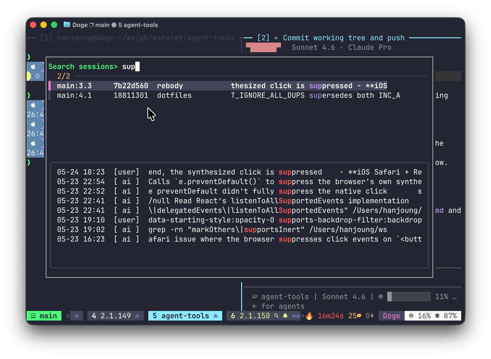

# tmux-claude-finder

Search across live interactive Claude Code sessions in tmux and jump to the matching pane.



> **Note:** Background/headless sessions are excluded; use `claude agents` for background sessions.

## How it works

1. Press `prefix + F` — discovers all running Claude Code sessions across tmux panes
2. Type a query — ripgrep searches conversation transcripts live as you type
3. Select a match — switches to that pane

## Requirements

- tmux 3.2+ (for `display-popup`)
- [ripgrep](https://github.com/BurntSushi/ripgrep) (`rg`)
- [fzf](https://github.com/junegunn/fzf)
- `jq`

## Install

**Via [TPM](https://github.com/tmux-plugins/tpm):**

Add to `tmux.conf`:

```tmux
set -g @plugin 'wateret/tmux-claude-finder'
```

Then press `prefix + I` to install.

**Manual:**

```bash
git clone https://github.com/wateret/tmux-claude-finder ~/.config/tmux/plugins/tmux-claude-finder
```

Add to `tmux.conf`:

```tmux
run-shell ~/.config/tmux/plugins/tmux-claude-finder/tmux-claude-finder.tmux
```

## Configuration

```tmux
# Key binding — pressed with tmux prefix (default: F)
set -g @claude-finder-key 'F'

# Popup dimensions
set -g @claude-finder-popup-width '80%'
set -g @claude-finder-popup-height '60%'
```

## How it finds sessions

1. Walks the process tree under each tmux pane looking for `claude` processes
2. Reads `~/.claude/sessions/<pid>.json` to get the session ID and working directory
3. Maps each session to its conversation transcript in `~/.claude/projects/`
4. Searches transcripts with `rg` for your query

## License

MIT
